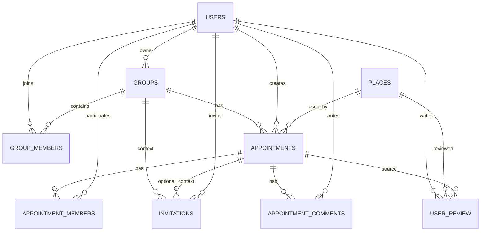

# 밥투게더 (bob-together)

> 그룹 기반 약속을 만들고 초대/참여/리뷰까지 관리하는 풀스택 웹 서비스

## 1. 프로젝트 개요

### 서비스 목적
`bob-together`는 단순 일정 등록이 아니라, 그룹 멤버십을 기준으로 약속 생성과 참여 권한을 관리하는 서비스입니다. 사용자 관점에서는 "약속을 쉽게 잡는 경험", 개발 관점에서는 "권한/정합성/성능"을 동시에 만족시키는 구조를 목표로 만들었습니다.

### 해결하려는 문제
- 다중 사용자 환경에서 초대 수락/거절, 멤버 참여/탈퇴 시 데이터 불일치가 발생하기 쉬운 문제
- 클라이언트 중심 권한 검증만으로는 우회 가능성이 생기는 문제
- 목록/상세/검색 화면이 많은 서비스에서 mutation 이후 stale 데이터가 남는 문제

### 핵심 가치
- 정합성: 중요한 쓰기 흐름을 RPC 트랜잭션으로 통합
- 보안성: RLS + 함수 실행 권한 화이트리스트 기반 통제
- 유지보수성: Server Action 응답 규약 + 캐시 무효화 규칙 문서화

## 2. 데모

- 서비스 URL: `<배포 URL 입력>`
- 테스트 계정(채용용):
- 이메일: `<TEST_EMAIL>`
- 비밀번호: `<TEST_PASSWORD>`

주의: 실제 저장소 공개 시 테스트 계정은 읽기 전용 권한 계정 사용을 권장합니다.

## 3. 주요 기능

- 회원가입, 로그인, 로그아웃
- 이메일 찾기, 비밀번호 재설정(사전 신원 검증)
- 그룹 생성, 검색, 가입, 탈퇴
- 그룹 멤버 초대 및 초대 응답 처리
- 약속 생성, 수정, 상태 변경(`pending`, `canceled`)
- 약속 멤버 초대, 참여, 나가기
- 약속 댓글 작성/조회
- 장소 리뷰 작성/조회, 내 리뷰/댓글/히스토리 조회
- 프로필 수정 및 프로필 이미지 관리

## 4. 기술 스택 (선택 이유 포함)

| 영역 | 기술 | 선택 이유 |
| --- | --- | --- |
| Frontend | Next.js 14 App Router, React 18 | Server/Client 컴포넌트 분리로 데이터 로딩 경계 명확화 |
| Language | TypeScript | 액션/DB 응답 타입 안정성 확보 |
| Backend BaaS | Supabase (Auth, Postgres, RLS, Storage) | 인증/DB/권한 정책을 한 플랫폼에서 일관성 있게 관리 |
| Data Access | Server Actions + Supabase RPC | 입력 검증/인증/에러 계약을 앱 레이어에서 표준화하고, 복잡 쿼리는 DB로 위임 |
| State/Cache | TanStack Query | 서버 상태 캐싱, 무효화 전략, 무한 스크롤 관리에 적합 |
| Validation | Zod + React Hook Form | 런타임 검증 + 폼 상태 관리의 조합으로 에러 분기 단순화 |
| Styling | Vanilla Extract | 타입 안전 스타일과 컴포넌트 단위 유지보수성 |
| Testing | Jest + Testing Library | Server Action 분기(성공/권한/검증 실패) 회귀 방지 |

## 5. 아키텍처

```text
Client UI
 -> Server Action (입력 검증, 인증 확인, 응답 규약)
 -> Supabase RPC / Table Query
 -> RLS + Grants + Security Definer 정책 검증
 -> ActionResult(ok/error/message) 반환
 -> React Query 캐시 반영 및 invalidate
```

아키텍처 원칙:
- 인증/권한 검증은 서버에서 최종 판정
- 다중 단계 쓰기 로직은 RPC 트랜잭션 우선
- 캐시 소유권은 Server/Client를 분리해 관리
- 에러 코드는 사용자 메시지와 분리해 일관된 계약 유지

## 6. 데이터 모델 (ERD)



핵심 엔티티:
- `users`, `groups`, `group_members`
- `appointments`, `appointment_members`, `invitations`
- `appointment_comments`, `user_review`, `places`

## 7. 주요 기술적 문제 해결

- 문제: 초대 수락 중간 실패 시 `멤버 추가됨 + 초대 상태 pending` 같은 불일치 가능성
- 해결: `respond_to_invitation_transactional` RPC로 멤버 반영과 초대 상태 변경을 원자화

- 문제: 액션마다 다중 쿼리가 누적되어 로직 복잡도와 실패 분기가 증가
- 해결: 그룹/약속/리뷰 핵심 액션을 단일 RPC 호출 패턴으로 전환하고 에러 코드 매핑 표준화

- 문제: 보안상 `SECURITY DEFINER` 함수가 넓게 열리면 오용 위험
- 해결: `PUBLIC`/`anon` 실행 권한 회수, 필요한 함수만 role별 grant 화이트리스트 적용

- 문제: 권한 파라미터 위조 시 사용자 스코프 데이터 노출 가능성
- 해결: 사용자 스코프 RPC에서 `p_user_id = auth.uid()` 바인딩 강제

## 8. 성능 개선

- `offset` 기반 페이지네이션을 키셋 커서 방식으로 전환해 깊은 페이지 조회 비용 완화
- 다중 쿼리 액션을 RPC 단일 호출로 통합해 round trip 및 앱 레이어 집계 부담 감소
- 댓글 mutation에서 루트 전체 invalidate 대신 국소 캐시 패치(`setQueryData`) 전략 적용
- mutation 무효화 플랜을 helper로 중앙화해 불필요한 재조회 범위 축소

## 9. 배운 점

- 기능 구현 속도보다 "권한 모델"을 먼저 설계해야 이후 수정 비용이 낮아짐
- 캐시 전략은 코드보다 규칙 문서화가 중요하며, 팀 합의 없이는 쉽게 드리프트 발생
- Server Action 응답 계약을 통일하면 UI 에러 처리 복잡도가 크게 줄어듦
- DB 중심 트랜잭션 설계가 실서비스 정합성에 직접적인 효과를 냄

## 10. 향후 개선 계획

- E2E 테스트 도입으로 핵심 사용자 플로우(가입, 초대, 약속 생성) 회귀 자동화
- Observability 강화(에러 코드/액션 실패율 대시보드)
- CI에서 마이그레이션/타입 정합성 자동 검증 파이프라인 추가
- 알림, 검색, 리뷰 영역에 대한 성능 지표 수집 및 튜닝 자동화

## 11. AI 활용 방법

### 어떻게 사용했는지 (이유 포함)
- 사용 방식: 기능 개발 전에 문서 인덱스(`ai_docs/INDEX.md`)를 기준으로 관련 컨텍스트를 먼저 수집하고, 변경 단위를 `migration -> action -> test -> docs` 순서로 쪼개서 AI에게 작업을 위임했습니다.
- 이유: 이 프로젝트는 DB 권한/RPC/캐시 무효화처럼 연쇄 영향이 큰 구조라, 한 번에 큰 수정보다 단계별 검증 가능한 단위가 회귀를 줄이기 유리했기 때문입니다.
- 사용 방식: 반복성이 높은 코드(액션 에러 매핑, 테스트 mock 패턴, README/문서 구조화)는 AI로 초안을 만들고, 정책성 판단(권한 범위, 함수 grant, 캐시 소유권)은 사람이 최종 결정했습니다.
- 이유: 생산성은 높이되 보안/권한 같은 고위험 결정은 사람 책임으로 남겨 품질 기준을 유지하기 위해서입니다.

### 어떤 문제가 있었고, 어떻게 바로잡았는지
- 문제: AI가 일반적인 Supabase 예시(`anon key` 중심)로 문서를 생성하면서 실제 프로젝트 키(`NEXT_PUBLIC_SUPABASE_PUBLISHABLE_KEY`)와 어긋나는 초안을 만든 적이 있었습니다.
- 바로잡기: `package.json`, `src/libs/supabase/server.ts`, 프로젝트 문서 기준으로 env 명세를 재검증해 README를 실제 실행 가능한 값으로 수정했습니다.

- 문제: DB 타입 재생성 절차를 스크립트로 단정하는 초안이 나와 현재 저장소 스크립트와 불일치가 발생했습니다.
- 바로잡기: 스크립트 존재 여부를 기준으로 문구를 교정하고, README에는 CLI 명령 예시를 명시해 환경 의존성을 줄였습니다.

- 문제: 권한 설정 제안에서 넓은 실행 권한이 포함될 가능성이 있었습니다.
- 바로잡기: 함수 실행 권한을 role 화이트리스트 원칙으로 제한하고(`service_role` 전용 등), `ai_docs/DB_RLS.md`와 마이그레이션을 함께 갱신해 정책과 코드를 동기화했습니다.

정리하면, AI는 \"초안 생성/반복 작업 가속\"에 집중하고, 최종 품질은 \"문서-코드-권한 정책 3중 교차검증\"으로 확보했습니다.

## 12. 실행 방법

### 요구사항
- Node.js 18+
- npm

### 설치 및 실행

```bash
npm install
npm run dev
```

접속: `http://localhost:3000`

### 환경 변수 (`.env.local`)

```bash
NEXT_PUBLIC_SUPABASE_URL=
NEXT_PUBLIC_SUPABASE_PUBLISHABLE_KEY=
SUPABASE_SERVICE_ROLE_KEY=
NEXT_PUBLIC_KAKAO_MAP_APP_KEY=
KAKAO_REST_API_KEY=
```

### 주요 명령어

- `npm run dev` 개발 서버
- `npm run build` 프로덕션 빌드
- `npm run start` 프로덕션 실행
- `npm run lint` 린트 검사
- `npm run type-check` 타입 검사
- `npm run test:changed` 변경 테스트
- `npm run test:ci` CI 테스트

Supabase 타입 재생성 예시:

```bash
supabase gen types typescript --project-id <project-id> > src/types/database.types.ts
```

---

참고 문서:
- [ai_docs/INDEX.md](ai_docs/INDEX.md)
- [ai_docs/DB_RLS.md](ai_docs/DB_RLS.md)
- [ai_docs/CACHE_OWNERSHIP.md](ai_docs/CACHE_OWNERSHIP.md)
- [ai_docs/DECISIONS.md](ai_docs/DECISIONS.md)
